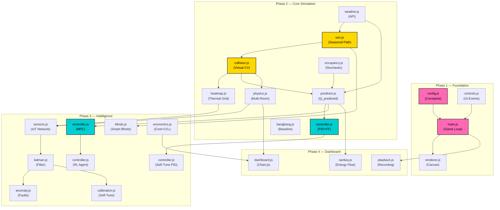

# Climate-Adaptive Smart Thermostat — v2.0 Implementation Plan

> [!IMPORTANT]
> This plan covers the full **14-hour hackathon** for the v2.0 Architecture (24 files, 22 features).
> **Team:** 2 members (Member A = Frontend/Visualization, Member B = Logic/Intelligence).
> **Stack:** Vanilla JS, HTML5 Canvas, Chart.js CDN, WeatherAPI.com. Zero npm. Zero build step.

---

## 0. Pre-Hackathon Checklist (Tonight — Sept 14)

### 0A. Repository & Tooling Setup (~30 min)
- [ ] Create GitHub repo: `climate-thermostat`
- [ ] Enable GitHub Pages deployment from `main` branch (Settings → Pages → Source: main / root)
- [ ] Clone repo to both team members' machines
- [ ] Get WeatherAPI key from [weatherapi.com](https://www.weatherapi.com/) (free tier = 1M calls/month)
- [ ] Test API key: `curl "https://api.weatherapi.com/v1/current.json?key=YOUR_KEY&q=Mumbai"`
- [ ] Bookmark Chart.js CDN: `https://cdn.jsdelivr.net/npm/chart.js`

### 0B. File Scaffolding (~15 min)
Create the entire 24-file skeleton with empty placeholder files:

```
climate-thermostat/
├── index.html
├── style.css
└── js/
    ├── main.js          # Entry point, game loop
    ├── config.js         # All constants, room data
    ├── renderer.js       # Canvas drawing
    ├── sun.js            # Sun engine + seasonal + forecast
    ├── collision.js      # AABB / 3D intersection
    ├── heatmap.js        # Thermal heatmap diffusion
    ├── physics.js        # Multi-room temp updates
    ├── predictor.js      # Q_predicted (5 vectors)
    ├── occupancy.js      # Stochastic occupancy model
    ├── controller.js     # PID+FF, MPC, RL, Self-Tuner
    ├── bangbang.js       # Standard thermostat baseline
    ├── blinds.js         # Smart blind controller
    ├── kalman.js         # Kalman filter + sensor fusion
    ├── anomaly.js        # Anomaly detection
    ├── calibration.js    # Digital twin calibration
    ├── weather.js        # WeatherAPI client
    ├── economics.js      # Cost + carbon tracker
    ├── sensors.js        # Simulated IoT sensors
    ├── dashboard.js      # Chart.js graphs
    ├── sankey.js         # Sankey energy flow
    ├── playback.js       # Recording + CSV export
    └── controls.js       # UI event listeners
```

### 0C. Boilerplate HTML (~10 min)
- [ ] Copy the `index.html` structure from System Architecture §16 into `index.html`
- [ ] Add Chart.js CDN `<script>` tag in `<head>`
- [ ] Add all 22 `<script src="js/...">` tags in correct dependency order (from §16)
- [ ] Verify page loads with no console errors (all scripts are empty but linked)

### 0D. Pre-Load Reference
- [ ] Both members read the System Architecture §3 (Module Breakdown) thoroughly tonight
- [ ] Member A focuses on: renderer.js, sun.js, collision.js, heatmap.js, physics.js, sensors.js, kalman.js, anomaly.js, calibration.js, dashboard.js, sankey.js
- [ ] Member B focuses on: config.js, weather.js, predictor.js, occupancy.js, controller.js, bangbang.js, blinds.js, economics.js, controls.js, playback.js, main.js

---

## 1. Phase 1 — Foundation (Hours 0–2)

**Goal:** Working canvas with multi-room floorplan drawn, config loaded, and basic game loop running.

### Member A (Rendering Pipeline)

| Time | File | Task | Priority | Est. |
|------|------|------|----------|------|
| 0:00–0:20 | `style.css` | Copy CSS from Architecture §17. Set up CSS Grid layout, dark theme variables, `.dashboard-grid`, `.sim-view`, `.sidebar-right`, panel styles. | 🔴 | 20m |
| 0:20–0:50 | `renderer.js` | Implement `render(ctx, state)` function. Write sub-functions: `drawRooms()` (walls, labels, fill colors), `drawFurniture()` (colored rectangles with labels), `drawBlinds()` (window overlays), `drawHVACIndicators()` (fan icon / power bar), `drawWeatherBadge()`, `drawTimeDisplay()`, `drawRoomTemperatures()`. Skip `drawSunRays()`, `drawThermalHeatmap()`, `drawIoTSensors()`, `drawForecastAlert()` (stubs only). | 🔴 | 30m |
| 0:50–1:30 | `renderer.js` | Implement `drawSunRays()` — iterate `state.sun.rays`, draw each as a semi-transparent yellow line from `(x1,y1)` to `(x2,y2)` with opacity proportional to `ray.intensity`. Test with hardcoded rays. | 🔴 | 40m |
| 1:30–2:00 | `renderer.js` | Polish room rendering. Add door openings between connected rooms. Add room temperature badges as rounded-rect overlays. | 🟡 | 30m |

### Member B (Data & Loop)

| Time | File | Task | Priority | Est. |
|------|------|------|----------|------|
| 0:00–0:30 | `config.js` | Copy full config from Architecture §18 and §4. Define `ROOMS[]` array (3 rooms with all objects, windows, bbox coordinates, thermalMass), `ROOM_CONNECTIONS[]`, PID constants, ASHRAE constants, canvas dimensions, color palette. | 🔴 | 30m |
| 0:30–1:00 | `main.js` | Implement `DOMContentLoaded` handler. Get canvas context. Create `simulationState` object (from Architecture §11). Set `simulatedHour = 6.0`. Add `requestAnimationFrame` loop calling `simulationTick()`. Implement `calculateDt()`. | 🔴 | 30m |
| 1:00–1:30 | `main.js` | Wire `render(ctx, state)` call inside the tick. Deep-copy `ROOMS` from config into state. Verify canvas draws rooms. Implement `formatTime()` helper. | 🔴 | 30m |
| 1:30–2:00 | `controls.js` | Implement basic event listeners: time speed slider (`#time-speed`), reset button (`#reset-btn`). Wire time speed to `state.simulationSpeed`. Implement `resetSimulation()`. | 🟡 | 30m |

### ✅ Checkpoint 1 (Hour 2)
- [ ] Page loads with dark theme dashboard layout
- [ ] Canvas shows 3-room floorplan (Living Room, Bedroom, Kitchen)
- [ ] Furniture items visible as colored rectangles with labels
- [ ] Time display updating in the corner
- [ ] Time speed slider changes simulation speed
- [ ] Reset button resets to 6:00 AM
- [ ] Environment dropdown switches between 🏠 Room, 🏢 Building, and 🏬 Office presets — rooms redraw instantly

---

## 2. Phase 2 — Core Simulation (Hours 2–5)

**Goal:** Sun moves, rays cast through windows, collisions detected, temperature changes, weather fetched, controllers responding.

### Member A (Simulation Engine)

| Time | File | Task | Priority | Est. |
|------|------|------|----------|------|
| 2:00–2:30 | `sun.js` | Implement `getSunAngle(hour, dayOfYear, latitude)` with solar declination formula. Implement `getSunIntensity(hour, cloudCover)` with sine curve + cloud attenuation factor `(1 - cloud/100 * 0.85)`. | 🔴 | 30m |
| 2:30–3:00 | `sun.js` | Implement `generateSunRays(sunAngles, windows, numRays=20)` — loop through each window, skip if `blindState === 'closed'`, generate rays with angle from azimuth, attenuate by blind state (`half=0.4`, `open=1.0`). | 🔴 | 30m |
| 3:00–3:30 | `collision.js` | Implement `getAABBIntersection(ray, objectBBox)` — clip ray segment to object bounding box, return `{hit, area}`. Implement `detectAllIntersections(rays, objects)` — loop all objects, sum areas, return results array with `{objectId, isIntersecting, intersectArea, thermalMass, roomId}`. | 🔴 | 30m |
| 3:30–4:00 | `physics.js` | Implement `updateMultiRoomTemperatures(rooms, connections, qPerRoom, hvacPerRoom, dt)`. Heat gain = `q / THERMAL_CAPACITANCE * dt`. HVAC removal = `COOLING_POWER * (hvac/100) / 60 * dt`. Inter-room diffusion through walls (`0.15`) and doors (`0.60`). Apply new temps. | 🔴 | 30m |
| 4:00–4:30 | `sun.js` | Implement `forecastThreats(currentHour, objects, windows, forecastHours=2)` — simulate future sun angles in 0.1h steps, run intersection tests, find objects with `thermalMass > 0.4` that will get hit, return sorted array `[{objectId, objectLabel, minutesUntil, estimatedHeatSpike, roomId}]`. | 🟡 | 30m |
| 4:30–5:00 | `heatmap.js` | Implement `ThermalHeatmap` class — constructor creates `Float32Array` grid. `injectHeat(objects, intersections)` adds heat to grid cells overlapping irradiated objects. `diffuse()` applies 4-neighbor Laplacian + decay. `getColor(value)` maps 0–1 to blue→cyan→green→yellow→red RGBA. `render(ctx)` draws colored cells. | 🟡 | 30m |

### Member B (Intelligence Core)

| Time | File | Task | Priority | Est. |
|------|------|------|----------|------|
| 2:00–2:30 | `weather.js` | Implement `fetchCurrentWeather()` using WeatherAPI `/current.json`. Return `{tempF, humidity, cloud, condition, uv}`. Add fallback data on fetch failure. Implement `fetchHourlyForecast()` using `/forecast.json?days=3`. Parse hourly array. | 🔴 | 30m |
| 2:30–3:00 | `weather.js` + `main.js` | Wire weather fetch into `main.js` init. Call `fetchCurrentWeather()` on load, store in `state.weather`. Set up 10-minute polling interval `setInterval(fetchCurrentWeather, 600000)`. Update weather badge DOM element. | 🔴 | 30m |
| 3:00–3:30 | `occupancy.js` | Implement `StochasticOccupancyModel` class — schedule object mapping hours to `{mean, std}`. `getExpectedOccupancy(hour)` does linear interpolation between schedule entries. `getUncertaintyBand(hour)` returns `{low, high}`. | 🔴 | 30m |
| 3:30–4:00 | `predictor.js` | Implement `calculateQPredicted(intersections, sunIntensity, occupancyModel, weather, rooms, dt)` — compute all 5 vectors: (1) Solar = Σ(intensity × area × thermalMass), (2) Occupancy = E[N] × 0.12, (3) Envelope = 0.35 × 45 × ΔT, (4) Humidity = 0.003 × Δhumidity × 45, (5) Decay = Σ(storedHeat × 0.1) with exponential decay. Return breakdown object. | 🔴 | 30m |
| 4:00–4:30 | `bangbang.js` | Implement `BangBangController` class — `compute(currentTemp)` returns 100% if above threshold, 0% if below threshold-hysteresis. | 🔴 | 10m |
| 4:00–4:30 | `controller.js` | Implement `FeedForwardPIDController` class — `compute(currentTemp, targetTemp, qPredicted, dt)`. P = Kp × error. Integral with anti-windup clamping ±50. D = Kd × (error - prev) / dt. FF = Kff × qPredicted. Output clamped 0–100%. | 🔴 | 20m |
| 4:30–5:00 | `main.js` | **Critical integration:** Wire everything into `simulationTick()`. Steps: (1) advance time, (2) getSunAngle, (3) generateSunRays, (4) detectAllIntersections, (5) calculateQPredicted, (6) PID compute, (7) BangBang compute, (8) updateMultiRoomTemperatures, (9) render. | 🔴 | 30m |

### ✅ Checkpoint 2 (Hour 5)
- [ ] Sun moves across the sky as time advances
- [ ] Yellow rays cast through windows, visually hitting furniture
- [ ] Room temperature rises when sun hits high-thermal-mass objects (Dark Sofa)
- [ ] PID controller engages HVAC cooling in response
- [ ] Bang-Bang controller visibly reacts later (delayed comparison)
- [ ] Weather badge shows live outdoor temperature
- [ ] Thermal heatmap visible as colored overlay on room floor
- [ ] Console logs show Q_predicted breakdown values

---

## 3. Phase 3 — Intelligence Layer (Hours 5–8)

**Goal:** Sensors, Kalman filter, anomaly detection, smart blinds, MPC, economics all operational.

### Member A (Sensor & Diagnostics Pipeline)

| Time | File | Task | Priority | Est. |
|------|------|------|----------|------|
| 5:00–5:30 | `sensors.js` | Implement `IoTSensorNetwork` class — place 4 sensors per room at fixed positions (near window, center, far corner, near door). `readAll()` adds Gaussian noise + HVAC vent bias to room temp. Include spatial variation from heatmap proximity. | 🟡 | 30m |
| 5:30–6:00 | `kalman.js` | Implement `KalmanFilter` class (predict/update cycle) and `MultiSensorFusion` class — creates one KalmanFilter per sensor with unique noise parameters. `fuseMeasurements()` runs predict→update on all, then inverse-variance weighted average for fused estimate. | 🟡 | 30m |
| 6:00–6:30 | `anomaly.js` | Implement `AnomalyDetector` class — rolling window of expected vs actual temps. Detect: (1) WINDOW_OPEN if cooling towards outdoor when shouldn't be, (2) UNEXPECTED_HEAT if heating without solar, (3) HVAC_DEGRADATION if high power but no cooling. Return `{type, severity, message, suggestion}`. | 🟡 | 30m |
| 6:30–7:00 | `calibration.js` | Implement `DigitalTwinCalibrator` class — `startCalibration()` begins observation collection. `recordObservation()` logs {predicted, actual, intersections}. `runCalibration()` requires 50+ observations, runs least-squares to adjust `thermalMass` per object. | 🟢 | 30m |
| 7:00–7:30 | `renderer.js` | Add `drawIoTSensors(ctx, sensors)` — render small circles at sensor positions, color-coded by reading (blue→red), with tiny temperature labels. Add `drawForecastAlert(ctx, forecast)` — render forecast threats as warning badges on canvas. | 🟡 | 30m |
| 7:30–8:00 | `main.js` | Wire sensors→kalman→anomaly pipeline into game loop. Create sensor/kalman/anomaly instances in init. Call `readAll()`, `fuseMeasurements()`, `anomalyDetector.check()` in tick. Store results in state. | 🟡 | 30m |

### Member B (Advanced Controllers & Economics)

| Time | File | Task | Priority | Est. |
|------|------|------|----------|------|
| 5:00–5:30 | `blinds.js` | Implement `SmartBlindController` class — `evaluate(forecast, qPredicted, rooms)` returns commands per window: close if imminent high-thermal threat (<15 min, spike>0.5), half if moderate threat (<30 min, spike>0.2), open if room needs passive heating. `getHVACReduction()` returns energy avoided. | 🟡 | 30m |
| 5:30–6:00 | `economics.js` | Implement `EconomicsTracker` class — time-of-use rates array (5 tiers: super off-peak 5¢ → peak 22¢). Carbon intensity by hour. `update(hour, predPower, stdPower, dt)` accumulates kWh cost and CO₂. `getSavings()` returns `{costSaved, carbonSavedKg, annualProjection, treesEquivalent}`. | 🟡 | 30m |
| 6:00–7:00 | `controller.js` | Implement `ModelPredictiveController` class — `compute()` with 60-min horizon, 12 steps. `generateCandidateSchedules()` creates 52 schedules (50 random from [0,10,20,30,50,75,100] + all-off + all-on). Evaluate each: simulate future temp using `getSunAngle`/`getSunIntensity`/`detectAllIntersections`, compute cost = Σ(tempDeviation² + λ×power²). Return first step of best schedule (receding horizon). | 🔴 | 60m |
| 7:00–7:30 | `controller.js` | Implement `RLAgent` class — Q-table based. `getState()` discretizes 8 state vars into string key. `selectAction()` with ε-greedy. `learn()` with Q-learning update rule. `getReward()` = -tempDeviation² - 0.1×power + comfort bonus. | 🟢 | 30m |
| 7:30–8:00 | `controller.js` | Implement `SelfTuningPID` class — wraps PID, runs `runEpoch(simulationFn)`. Numerical gradient: perturb each of [Kp, Ki, Kd, Kff] by ε=0.01, compute cost(+ε) and cost(-ε), gradient = (cost+ - cost-) / 2ε, update param -= learningRate × gradient. Clamp non-negative. | 🟢 | 30m |

### ✅ Checkpoint 3 (Hour 8)
- [ ] IoT sensor dots visible on canvas with individual readings
- [ ] Kalman fused estimate shown (smoother than raw readings)
- [ ] Smart blinds close automatically when sun approaches high-thermal objects
- [ ] Blinds visually change on canvas (open→half→closed)
- [ ] MPC controller produces noticeably smoother/earlier HVAC response than PID
- [ ] Economics tracker showing live cost and carbon values
- [ ] Anomaly detection fires when simulating an "open window" scenario
- [ ] Calibration mode starts/stops without crashing

---

## 4. Phase 4 — Dashboard & Visualization (Hours 8–11)

**Goal:** Full interactive dashboard with charts, controls, Sankey, playback, and comparison mode.

### Member A (Charts & Visualization)

| Time | File | Task | Priority | Est. |
|------|------|------|----------|------|
| 8:00–8:45 | `dashboard.js` | Implement `initCharts()` — create 4 Chart.js instances: (1) Temperature line chart (Predictive vs Standard vs Target), (2) Power area chart (Predictive vs Standard), (3) Energy bar chart (cumulative kWh), (4) Q-breakdown stacked area (Solar/Occupancy/Envelope/Humidity/Decay). All with `animation: { duration: 0 }` for performance. | 🔴 | 45m |
| 8:45–9:30 | `dashboard.js` | Implement `updateCharts(charts, history, economics)` — push new data points, trim to last 500 points, update all chart datasets. Implement `logDataPoint(state)` — record temps, power, Q breakdown to `state.history` every 30 frames. | 🔴 | 45m |
| 9:30–10:15 | `sankey.js` | Implement `SankeyDiagram` class — render using Canvas 2D. Left side: 5 source flows (Solar, Occupancy, Envelope, Humidity, Decay) as colored bars proportional to their contribution. Center: "Room" node. Right side: sinks (HVAC Removed, Blinds Blocked, Retained Heat). Connect with bezier curves. Color-coded by source. | 🟡 | 45m |
| 10:15–11:00 | `dashboard.js` | Add comfort score gauge (simplified PMV). Add Kalman estimate vs raw sensors sparkline. Add blind state timeline bar showing open/half/closed over time. Wire all new charts into `updateCharts()`. | 🟡 | 45m |

### Member B (Controls, Forecast Panel & Playback)

| Time | File | Task | Priority | Est. |
|------|------|------|----------|------|
| 8:00–8:45 | `controls.js` | Implement all 11 control event listeners: (1) Mode select (bangbang/pidff/mpc/rl), (2) Time speed slider 1×–120×, (3) Occupancy override 0–10, (4) Target temp slider 65–80°F, (5) Season dropdown (Spring=80, Summer=172, Fall=266, Winter=355), (6) Sun override slider 6AM–6PM, (7) Per-window blind toggles, (8) Calibrate button, (9) Record/Stop/Play/Export button group, (10) Reset button, (11) Side-by-side comparison toggle. | 🔴 | 45m |
| 8:45–9:30 | `controls.js` | Implement forecast panel UI: `updateForecastPanel(threats)` — render `<li>` items like "☀️ Sun hits Dark Sofa in 12 min (+0.85 heat spike)". Implement `updateAnomalyPanel(alerts)` — render red `<li>` items with severity icons. Implement `updateSensorPanel(readings, fused)` — render sensor grid with fused estimate + uncertainty band. Implement `updateSavingsPanel(savings)` — update `$X.XX saved` and `X.XX kg CO₂ avoided` DOM elements. | 🔴 | 45m |
| 9:30–10:15 | `playback.js` | Implement `PlaybackEngine` class — `startRecording()`, `recordFrame(state)` (minimal deep-copy: time, room temps, hvac power, Q breakdown, weather, cost), `stopRecording()` (save to localStorage, keep last 10), `playback(id)`, `getFrame(index)`, `exportCSV(id)` (generate CSV string, create download link, trigger click), `listRecordings()`. | 🟡 | 45m |
| 10:15–11:00 | `main.js` | Implement side-by-side comparison mode: when `state.comparisonMode === true`, run BOTH bang-bang and predictive controller in parallel, maintain separate room temp arrays for each, pass both to charts. Wire playback recording into tick (if isRecording, call recordFrame). Wire all UI updater functions into render step. | 🟡 | 45m |

### ✅ Checkpoint 4 (Hour 11)
- [ ] Temperature chart shows live Predictive (cyan) vs Standard (red) vs Target (green dashed) lines
- [ ] Power chart shows HVAC usage comparison
- [ ] Energy bar chart shows cumulative kWh side by side
- [ ] Q-breakdown stacked area shows all 5 heat vectors
- [ ] Sankey diagram shows energy flow from sources → room → sinks
- [ ] All 11 controls are functional (mode switch, speed, season, etc.)
- [ ] Forecast panel shows "Sun hits X in Y min" countdown
- [ ] Anomaly panel shows alerts when triggered
- [ ] Sensor panel shows individual readings + fused estimate
- [ ] Savings panel shows dollar and carbon savings
- [ ] Record/Stop/Play/Export buttons work
- [ ] CSV downloads with populated data
- [ ] Side-by-side comparison mode produces visually distinct curves

---

## 5. Phase 5 — Integration & Polish (Hours 11–13)

**Goal:** Everything working together seamlessly. Polished UI. Deployed.

### Joint Tasks (Both Members)

| Time | Task | Owner |
|------|------|-------|
| 11:00–11:30 | **Integration Testing.** Run full simulation 6AM→6PM at 60× speed. Watch for: NaN temperatures, chart overflow, infinite loops, console errors. Fix any data flow breaks between modules. | Both |
| 11:30–12:00 | **PID Tuning.** Start with conservative values (Kp=1, Ki=0.01, Kd=0.5, Kff=1). Increase Kff until predictive mode visibly pre-cools before solar events. Increase Kp until responsive but not oscillating. Log final values to console. Run Self-Tuning PID for 3 epochs to validate gradient descent works. | Member B |
| 11:30–12:00 | **Renderer Polish.** Add gradient fills for rooms. Add sun glow effect. Smooth heatmap transitions. Ensure sensor labels don't overlap. Add room names as header labels. | Member A |
| 12:00–12:20 | **CSS Polish.** Fine-tune panel spacing. Ensure charts resize with container. Add subtle border-glow on active panels. Test at 1920×1080 and 1366×768 resolutions. | Member A |
| 12:00–12:20 | **Edge Cases.** Test: What happens at hour 0 (midnight)? What happens if WeatherAPI fails? What happens if localStorage is full? Add graceful fallbacks. | Member B |
| 12:20–12:40 | **Final Bug Fixes.** Fix any remaining console warnings. Ensure all `Math.max(0, ...)` guards are in place for negative values. Test season switching mid-simulation. | Both |
| 12:40–13:00 | **Deploy.** Push to GitHub. Verify GitHub Pages URL loads correctly in Chrome Incognito. Test on both team members' phones (responsive). Save the live URL. | Both |

### ✅ Checkpoint 5 (Hour 13)
- [ ] Zero console errors
- [ ] Full day simulation runs without NaN or infinite values
- [ ] All controller modes produce visually distinct behavior
- [ ] Weather badge shows live data (or graceful fallback)
- [ ] Smart blinds close/open at correct times
- [ ] Economics panel shows non-zero savings
- [ ] Deployed URL accessible from any browser
- [ ] Works at projector resolution (1920×1080)

---

## 6. Phase 6 — Demo Prep (Hours 13–14)

> [!WARNING]
> **ZERO code changes after Hour 13.** Only practice the demo script and test the projector.

### Demo Script (6 Steps — 5 minutes total)

| Step | Time | Script | What to Click |
|------|------|--------|---------------|
| 1. **"This is the problem."** | 45s | "Traditional HVAC systems are reactive. They wait until the room is already too hot, then blast the AC at 100%. Watch." | Select "Standard (Bang-Bang)" mode. Set speed to 60×. Let simulation run to noon. Point at the temperature spike and power chart showing 100% blast. |
| 2. **"This is our solution."** | 60s | "Our system predicts heat before it arrives, using a Vision-Predictive Digital Twin. Watch the same scenario." | Click Reset. Select "Predictive (PID+FF)" mode. Set speed to 60×. Point out the Forecast Panel: "Sun hits Dark Sofa in 25 min." Watch blinds auto-close. Watch HVAC engage at 15% early. Room never exceeds 73°F. |
| 3. **"Here's the intelligence."** | 60s | "We calculate heat across 5 vectors: Solar, Occupancy, Envelope, Humidity, and Thermal Decay. Then we run it through a Kalman Filter to handle sensor noise." | Point at Q-breakdown chart. Point at sensor panel showing raw vs fused estimate. Point at the thermal heatmap showing heat radiating from the sofa. |
| 4. **"Real-world impact."** | 45s | "The predictive mode saved \$2.47 today. That's \$900 projected annually. It also avoided 1.2 kg of CO₂ — equivalent to planting 21 trees." | Point at Savings Panel. Point at Sankey diagram: most heat goes to "Blinds Blocked" instead of "Retained Heat". |
| 5. **"Self-learning."** | 45s | "Switch to MPC mode — now the system looks 60 minutes ahead and optimizes the entire HVAC schedule. We also have a Reinforcement Learning agent and Self-Tuning PID that learn autonomously." | Switch to MPC mode. Briefly mention RL and Self-Tuning. Click Calibrate to show digital twin learning. |
| 6. **"It works everywhere."** | 45s | "This system isn't hardcoded for one room. Watch — I'll switch from a studio apartment to a business office with a server room generating heat 24/7. The AI adapts instantly. And it's all 24 vanilla JS files, zero servers, deployable to GitHub Pages in 30 seconds." | Click Environment dropdown → switch to 🏬 Office. Point at Server Closet staying at 65°F. Switch to 🏠 Room. Show sun-sofa collision in simple view. Open DevTools briefly — no npm. |

### Demo Prep Tasks

| Time | Task |
|------|------|
| 13:00–13:15 | Practice demo 2× through (each person practices once) |
| 13:15–13:30 | Test projector/screen. Adjust browser zoom if needed (Ctrl+/Ctrl-). Ensure charts are readable. |
| 13:30–13:45 | Prepare backup: download the repo as .zip on a USB drive. Save a pre-recorded screen capture if possible. |
| 13:45–14:00 | Final walkthrough. Agree on who presents which slides. Both ready. |

---

## 7. Critical Path Dependency Graph



---

## 8. Risk Mitigation Table

| # | Risk | Probability | Impact | Detection | Fallback |
|---|------|-------------|--------|-----------|----------|
| 1 | Three.js Raycasting too slow / complex to set up | Medium | High | Frame rate drops below 30fps | Use 2D AABB collision only (Architecture §3 fallback code). Skip 3D entirely. |
| 2 | WeatherAPI rate limit exceeded (1M/month free) | Low | Medium | HTTP 429 response | Cache last successful response. Use hardcoded fallback: `{tempF: 95, humidity: 60, cloud: 0}`. |
| 3 | WeatherAPI down during demo | Low | High | Fetch error | Pre-fetch data during setup and store in `localStorage`. Show "Cached" badge. |
| 4 | RL Agent Q-table too sparse / doesn't converge | High | Low | Agent picks random actions after 1000+ steps | RL is demo-only. Fallback to MPC which is deterministic and always works. |
| 5 | Self-Tuning PID gradient descent diverges | Medium | Low | PID params go to 0 or 999 | Clamp all params to [0.01, 10.0]. Fallback to default constants from config. |
| 6 | MPC too slow (52 schedules × 12 steps × intersection tests) | Medium | Medium | `simulationTick` takes >50ms | Reduce candidates to 20 schedules, 6 steps. Or run MPC every 60 frames instead of every frame. |
| 7 | localStorage quota exceeded (playback recordings too large) | Low | Low | `QuotaExceededError` | Catch error. Reduce frame recording to every 10th frame. Limit to 5 recordings max. |
| 8 | Chart.js performance degrades with too many data points | Medium | Medium | Charts visibly lagging | Trim history to last 200 points (currently 500). Disable chart animations. |
| 9 | Sankey diagram rendering math errors | Medium | Low | NaN in flow widths / bezier curves | Add `Math.max(0.01, ...)` guards. If still broken, disable Sankey and show Q-breakdown chart only. |
| 10 | CSS Grid layout breaks on projector (non-standard resolution) | Low | Medium | Panels overlap or cut off | Prepare backup: single-column layout CSS class that can be toggled with a keyboard shortcut. |
| 11 | Multiple team members editing same file (merge conflict) | Medium | Medium | Git conflict on push | Member A owns renderer/heatmap/sensors/kalman/anomaly/dashboard/sankey. Member B owns everything else. No overlap. |
| 12 | Kalman filter uncertainty grows unbounded | Low | Low | Uncertainty band fills entire chart | Reset Kalman state every 1000 frames. Add `Math.min(10, P)` ceiling on uncertainty. |

---

## 9. Verification Plan

### Automated Checks (Run Before Each Checkpoint)
```bash
# 1. No syntax errors in any JS file
find js/ -name "*.js" -exec node --check {} \;

# 2. All files exist
ls -la js/*.js | wc -l  # Should be 22

# 3. HTML loads without 404s (start local server)
python -m http.server 8080
# Open http://localhost:8080 in Chrome → DevTools Console → check for red errors
```

### Manual Verification Checklist
- [ ] Temperature stays between 50°F and 120°F at all times (no NaN/Infinity)
- [ ] All 3 rooms show independent temperatures
- [ ] Switching seasons changes sun angle visibly (summer = steep, winter = shallow)
- [ ] Switching from PID to MPC shows noticeably smoother early response
- [ ] Pressing "Reset" returns everything to 6:00 AM / 72°F
- [ ] Weather badge updates within 10 seconds of page load
- [ ] Opening a simulated "window" (override to cool rapidly) triggers anomaly alert
- [ ] Recording → Stop → Export CSV downloads a valid file openable in Excel
- [ ] Sankey diagram flows proportionally change as solar load changes
- [ ] Smart blinds close before sun hits Dark Sofa (visible on canvas)
- [ ] Economics panel shows dollar savings > $0 after running predictive mode for 1 simulated hour

---

## 10. Fallback Strategy (Priority-Ordered Scope Cuts)

If running behind schedule, cut features in this exact order:

| Cut Order | Feature | Module | Why It's Safe to Cut |
|-----------|---------|--------|---------------------|
| 🟢 Cut 1st | Digital Twin Calibration | `calibration.js` | Nice for judges but not visually impactful. Demo without it. |
| 🟢 Cut 2nd | RL Agent | `controller.js` (7D) | Q-table won't converge in a hackathon demo. MPC is more impressive. |
| 🟢 Cut 3rd | Self-Tuning PID | `controller.js` (7C) | Gradient descent requires multiple simulation runs. Manual PID tuning works fine. |
| 🟡 Cut 4th | Sankey Diagram | `sankey.js` | Canvas bezier rendering is fiddly. Q-breakdown chart shows same data. |
| 🟡 Cut 5th | Side-by-Side Comparison | `playback.js` | Requires maintaining dual state arrays. Manual toggle between modes works. |
| 🟡 Cut 6th | Historical Playback | `playback.js` | Recording/export is nice but not core to the demo story. |
| 🔴 Never Cut | Multi-Room Canvas + Sun + Collision + PID+FF + Heatmap + Weather + Blinds + Charts + Forecast Panel + Economics | Core modules | These are the demo backbone. Without any one of these, the story falls apart. |

---

## 11. Feature → File → Phase Matrix

| # | Feature | File(s) | Phase | Owner | Priority |
|---|---------|---------|-------|-------|----------|
| — | HTML/CSS Scaffold | `index.html`, `style.css` | 1 | A | 🔴 |
| — | Constants & Room Data | `config.js` | 1 | B | 🔴 |
| — | Game Loop & Init | `main.js` | 1 | B | 🔴 |
| — | Canvas Renderer | `renderer.js` | 1 | A | 🔴 |
| 8 | Seasonal Sun Path | `sun.js` | 2 | A | 🔴 |
| T4 | Cloud Cover | `sun.js` | 2 | A | 🔴 |
| T1 | Forecast Panel | `sun.js` | 2 | A | 🟡 |
| 12 | 3D Raytracing / AABB | `collision.js` | 2 | A | 🔴 |
| 13/T2 | Thermal Heatmap | `heatmap.js` | 2 | A | 🟡 |
| 10 | Multi-Room Physics | `physics.js` | 2 | A | 🔴 |
| 11 | Thermal Diffusion | `physics.js` | 2 | A | 🔴 |
| 23 | Weather Forecast | `weather.js` | 2 | B | 🔴 |
| 22 | Stochastic Occupancy | `occupancy.js` | 2 | B | 🔴 |
| 9 | Humidity/Latent Load | `predictor.js` | 2 | B | 🔴 |
| — | Bang-Bang Controller | `bangbang.js` | 2 | B | 🔴 |
| — | PID+FF Controller | `controller.js` | 2 | B | 🔴 |
| 18 | IoT Sensor Network | `sensors.js` | 3 | A | 🟡 |
| 4 | Kalman Filter | `kalman.js` | 3 | A | 🟡 |
| 5 | Anomaly Detection | `anomaly.js` | 3 | A | 🟡 |
| 21 | Digital Twin Calibration | `calibration.js` | 3 | A | 🟢 |
| T5 | Smart Blind Control | `blinds.js` | 3 | B | 🟡 |
| T3 | Cost + Carbon Tracker | `economics.js` | 3 | B | 🟡 |
| 2 | MPC Controller | `controller.js` | 3 | B | 🔴 |
| 3 | RL Agent | `controller.js` | 3 | B | 🟢 |
| 1 | Self-Tuning PID | `controller.js` | 3 | B | 🟢 |
| — | Chart.js Dashboard | `dashboard.js` | 4 | A | 🔴 |
| 14 | Sankey Diagram | `sankey.js` | 4 | A | 🟡 |
| — | UI Controls (11 controls) | `controls.js` | 4 | B | 🔴 |
| 15 | Historical Playback | `playback.js` | 4 | B | 🟡 |
| T6 | Multi-Environment Presets | `config.js` | 1 | B | 🔴 |
| T6 | Environment Switcher UI | `controls.js`, `index.html` | 1 | A | 🔴 |
| T6 | Environment-Aware Init | `main.js` | 1 | B | 🔴 |
